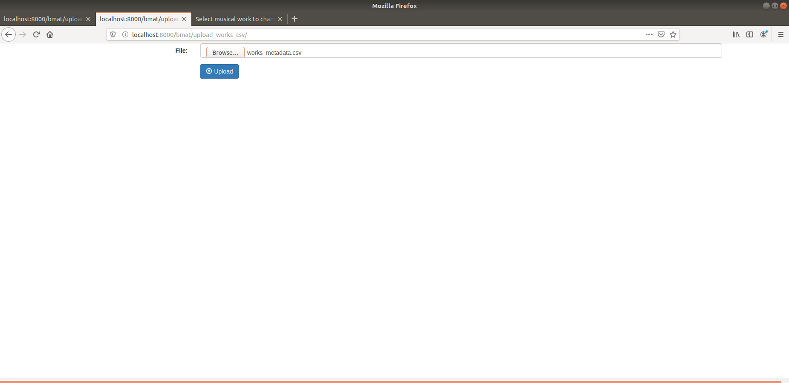
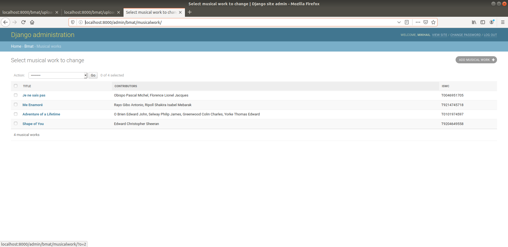
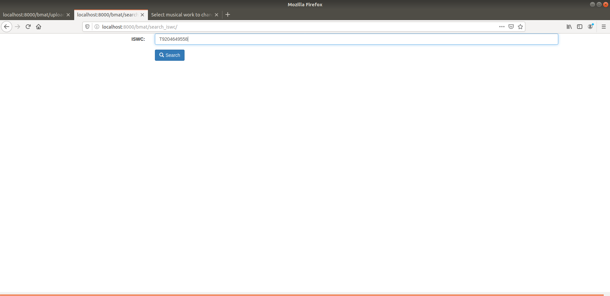
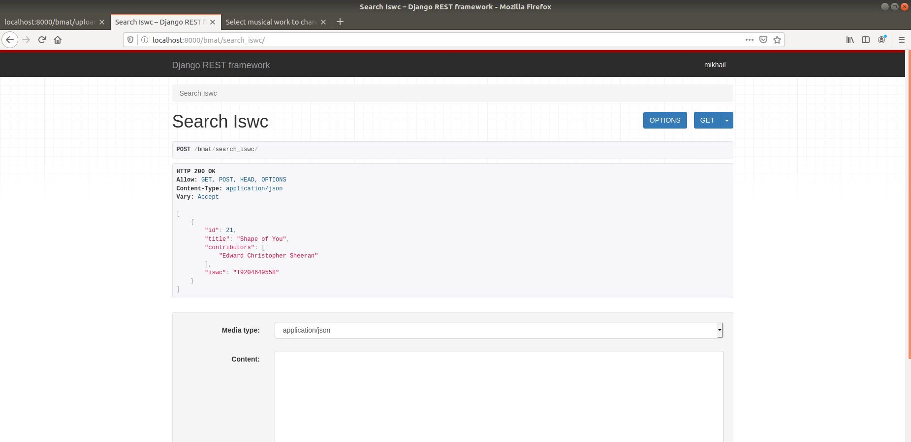

#BMAT-TEST

## 1. Pre-Requirement

### 1) PostgreSQL
    DATABASES = {
        'default': {
            'ENGINE': 'django.db.backends.postgresql',
            'NAME': 'bmat',
            'USER': 'postgres',
            'PASSWORD': 'password',
            'HOST': '127.0.0.1',
            'PORT': '5432',
        }
    }
    
### 2) DEPENDENCY
    pip install -r requirement.txt
    
      
## 2. How it works

### 1) Migrations & Create superuser & Run Server
    python manage.py makemigrations
    python manage.py migrate
    
    python manage.py createsuperuser
    <enter your email & name & password>   
    
    python manage.py runserver
    
    
### 2) Musical	work reconciliation

   - Enter following url in web browser
   http://localhost:8000/bmat/upload_works_csv/ 
   
   
   - Upload the musical metadata csv file
   
   - Click 'Upload' button.
   
   - You can see the result here
   http://localhost:8000/admin/bmat/musicalwork/
   
   
   
   
### 3) Works	Single	View	API

   - Enter following url in web browser
   http://localhost:8000/bmat/search_iswc/
   
   
   - Input the iswc and click 'Search' Button
   
   - Result
   